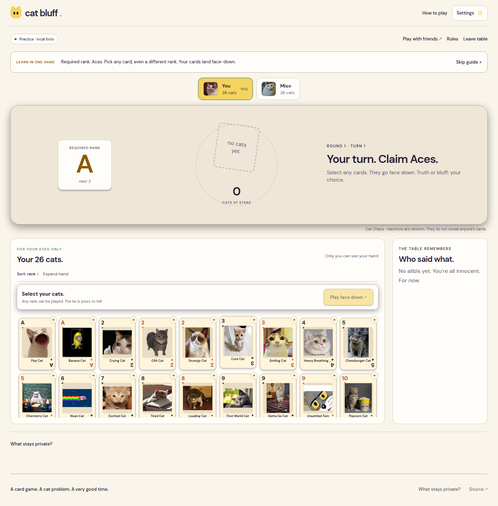

# Cat Bluff


> 52 meme cats. Four of every rank. Lie to your friends—or risk picking up the whole pile.

Cat Bluff is a **2–4 player cat-meme card game** built around private hands, public claims and calling a friend's bluff. The card rank determines the rules; the cat picture gives each card its personality. Midnight verifies legal moves and challenged plays while unchallenged cards stay face down.

**Release status:** Classic 52 is deployed on Preprod. The current frontend includes the clubhouse interface, step-by-step practice and shared public-room reads. A complete multiplayer Preprod playthrough remains pending; frontend deployment does not establish that verification.



[Welcome screen](screenshots/clubhouse-home.png) · [Mobile table](screenshots/classic52-mobile.png) · [Dark clubhouse](screenshots/classic52-dark.png). These screenshots show the current interface and local practice, not blockchain transactions.

## Live Demo

[Play Cat Bluff](https://cat-bluff-ashuu.vercel.app/) · [Public repository](https://github.com/ashuujha/cat-bluff) · [Product X: @catbluffgame](https://x.com/catbluffgame)

[Cat Bluff Classic 52 preview](https://cat-bluff-git-feature-classic-52-ashuujha.vercel.app) — may require Vercel sign-in while release validation is in progress.

### Learn without a wallet

Choose **Learn in one hand**, pick 2, 3 or 4 players, then **Deal the cats**. You play against 1–3 local bots; practice generates no proofs or transactions.

| Practice pace | What happens |
| --- | --- |
| **Step by step** — default | You advance each bot play, response and reveal. After a settled turn, read the explanation and choose **Got it · next turn**. |
| **Relaxed auto** | Bots act after 3.5 seconds. Results remain for 6.5 seconds. Your own decisions never time out, and background tabs pause the bots. |

Read the required rank, select any cards from your hand, then choose **Play face down**. A different rank is a bluff, not an invalid selection. The practice companion explains each public action and who takes the pile. Hide or restore tips at any point; switch back to step-by-step whenever you want to slow down.

### Bring friends

For live Classic 52 play, choose **Create room**, connect Lace and create a table. Copy the invite link from the lobby and send it to 1–3 people. Friends can open the link or paste it under **Join room**. Each joins with their own wallet and browser. The host can start with **two, three or four players**. Invitations contain public room and contract IDs; they never include table keys or hands.

Existing V3 invitation links still open the earlier five-cat table. The new lobby also includes **Open earlier five-cat tables**. No V3 contract or saved hand is migrated or overwritten.

## Contract Address

| Version | Network | Address / deployment status |
| --- | --- | --- |
| Classic 52 V4 | Preprod | [`616618c2dd897208bc75fdf25a912fad5567d97935d002a199b8a528b1def946`](https://preprod.midnightexplorer.com/contracts/0x616618c2dd897208bc75fdf25a912fad5567d97935d002a199b8a528b1def946) — schema 4; all ten circuit verifier keys checked |
| Earlier Cat Bluff V3 | Preprod | [`3cc6418a04b9d1e6deab06e5711e4e3c3876e697ba412202f932ebe030bc917e`](https://preprod.midnightexplorer.com/contracts/0x3cc6418a04b9d1e6deab06e5711e4e3c3876e697ba412202f932ebe030bc917e) — schema 3 and seven circuit verifier keys checked; earlier five-cat rules |

V4 has **schema 4 and ten public circuits**. The V3 address belongs only in `VITE_CAT_BLUFF_CONTRACT_ADDRESS`. A frontend deployment does not deploy a contract. Each version needs its own address from the table above.

V4 deployment: Preprod block **2,715,402**, transaction `065011fb07056ea87e768428697ed0f5bd27cd6846b69e2f3fae77b380866591`. Schema 4 and all ten verifier keys match the compiled contract.

## What This Does

1. **Deal every cat.** A single 52-card deck contains 13 ranks and four physical copies of each. Each card has its own cat meme image. Two players get 26 each; three get 18/17/17; four get 13 each.
2. **Play face down.** Select one or more cards. The required rank starts at Ace. Playing two cards declares “2 Aces.” The quantity is exact; the ranks may be a lie.
3. **Trust or BLUFF!** Opponents respond clockwise. If everyone trusts, the cards stay face down in the central pile. The next player claims the next rank: A → 2 → … → K → A.
4. **Risk the entire pile.** A challenge opens only the cards from that turn. Any wrong rank means the bluffer takes the whole pile. An honest play means the challenger takes it. Earlier unchallenged cards are not publicly revealed during pickup.
5. **Survive your final claim.** An empty hand wins only after the final play is passed by every opponent or its challenge and pile transfer finish. A caught final bluff returns the pile to the player instead of declaring a winner.
6. **Play again.** The host starts another round in the same room, with a fresh joint shuffle.

There are no extra cards, replacement draws, stakes, coins, powers or artificial game timers. The growing pile supplies the risk. You can reason from your hand, the four-copy limit, opponents' hand counts and the public history. A passed claim is recorded as **trusted**, not as a proven lie or truth.

**Example:** the required rank is Queen. You play two cards and claim “2 Queens.” Two Queens is honest; a Queen and a King is a bluff. If someone calls BLUFF, those two cards open and the losing side takes every card in the pile. Once the turn is settled, the next required rank is King. A random Cat Chaos reaction after the play gives no evidence about either card.

### Private multiplayer

Players jointly shuffle and re-randomize an encrypted 52-card deck. Each shuffle proves a permutation of the original deck. Each player then removes their encryption layer from the other players' assigned cards, leaving each recipient's layer intact. Each player opens only their own hand locally; there is no hosted dealer.

Setup requires a shuffle and a deal-share transaction from each player. On a challenged pickup, relevant contributors privately re-encrypt their pile cards for the recipient. Play resumes when the pickup finishes. All required contributors must remain online; this version cannot force an absent player to open or transfer cards.

### The clubhouse

The interface uses a calm plum clubhouse, warm ivory cards, amber highlights and slate-lilac accents. DM Sans is used throughout, including the landing headline.

- The landing card stack and the meme beside the name change between visits. **New suspects** reshuffles the decorative lineup.
- Scrolling introduces the card lineup and instructions with short staggered entrances; a small cat tilts with the scroll. The active game table stays steady.
- Opening a playful rules question can trigger a short random meme and its sound. Clips do not overlap, and meme mute remains available.
- **Settings** remembers the light/dark theme and separate switches for game sounds, meme sounds and motion. System reduced-motion preferences are respected.
- The game table keeps the required rank, latest claim, pile size and available action visible. Sort your hand, expand it into a grid, inspect your own cards, and clear selections before submitting. Opponent hands stay face down.

These effects do not change the card rules or add transactions.

### Cat Chaos and presentation

Each new face-down play triggers a **random 1.2-second cat reaction**. Selection reads no cards, ranks or truthfulness; matching memes are coincidences. Reactions are local to each viewer, may repeat, respect mute/reduced-motion settings and never delay BLUFF or change a transaction.

All 52 card faces download together as one catalog, so image requests do not identify your private cards. The short game reaction is separate from the longer, optional landing-page reactions. Neither uses hidden gameplay information.

Practice needs no proving runtime. Live play caches and prefetches circuit assets, and shows actual proof, wallet, submission and confirmation stages. Proof generation and confirmation still take time; full live latency is not yet measured. Large shuffle/deal proofs need more prover memory than ordinary plays.

## Privacy Model

- **PUBLIC:** room IDs, pseudonymous seats, public encryption keys, encrypted deck, opaque card-slot ownership, hand sizes, required rank, chosen slots, pile size, quantities, responses, history, challenge openings, results and winner.
- **PRIVATE:** identity and encryption secrets, shuffle permutation and blinding values, unchallenged plaintext cards and the remaining hand. Table keys persist locally under the wallet, contract and room.
- **PROVED without revealing the rest of a hand:** knowledge of a seat's secret; a valid permutation and re-encryption of the original deck; correct private dealing; legal ownership of selected physical cards; truthful opening of the challenged cards; and unchanged plaintext during private pile transfers.

## Privacy Claim

Observers see declarations, quantities, responses and encrypted-slot movements. A challenge reveals **all cards from that play**, whether the claim was true or false. Other cards stay encrypted, but previous reveals, slot tracking and public counts can support deductions.

**Two-player deduction:** when all 52 cards are dealt between two players, each can infer the other's initial hand as its complement. The chosen face-down cards and their encrypted-slot identities remain hidden until revealed or deduced. Three or four players add uncertainty; collusion can reduce it.

The joint shuffle uses ElGamal-style encryption over Midnight's Jubjub operations. Privacy depends on private keys and at least one honest, unpredictable shuffle contribution. The circuit proves a valid permutation, not honest randomness. The protocol has not received an independent security audit.

**A remote prover sees private inputs**, including table keys. A shared prover could reconstruct the deck or impersonate seats. Use a compatible prover on your own device for privacy from the proving service. A localhost bridge forwarding to a hosted service still uses remote proving. V4 defaults to Lace's prover; `VITE_CLASSIC_PROOF_SERVER_URL` explicitly selects another provider.

Keep the same wallet, browser profile and site address for an existing hand. Private keys are stored locally; clearing browser data or switching origins can make participation unrecoverable. Anyone with access to that browser profile can read them. The live UI decrypts only the local player's hand, and no game API or log exposes opponents' plaintext hands.

## Tech Stack

| Layer | Technology |
| --- | --- |
| Interface | Existing React 19, TypeScript, Vite 7 and custom CSS |
| V4 contract | Compact 0.31.1, schema 4, ten public circuits |
| Network / wallet | Midnight Preprod / Lace connector API 4 |
| Client | Midnight.js 4.1.1, Compact runtime 0.16 |
| Tests | Node test runner via tsx; real compiled-circuit simulation |
| CI / hosting | GitHub Actions / Vercel |

## Prerequisites

- Node.js 22 and npm.
- Compact CLI 0.5.2, compiler 0.31.1; [official tooling guide](https://docs.midnight.network/compact/compilation-and-tooling).
- Live players: Lace on Preprod, usable tDUST and a working proof server.
- Two separate wallet/browser profiles to test a real multiplayer round. Practice needs none.

## Setup & Run Locally

```bash
git clone --branch feature/classic-52 https://github.com/ashuujha/cat-bluff.git
cd cat-bluff
npm ci
compact update 0.31.1
npm run compile
cat > .env.local <<'ENV'
VITE_MIDNIGHT_NETWORK=preprod
# Keep the earlier contract available for existing rooms:
VITE_CAT_BLUFF_CONTRACT_ADDRESS=3cc6418a04b9d1e6deab06e5711e4e3c3876e697ba412202f932ebe030bc917e
# Verified Classic 52 Preprod deployment:
VITE_CLASSIC_CONTRACT_ADDRESS=616618c2dd897208bc75fdf25a912fad5567d97935d002a199b8a528b1def946
# Omit VITE_CLASSIC_PROOF_SERVER_URL to use Lace's configured prover.
ENV
npm run dev
```

Open the Vite URL. **Learn in one hand** gives an instant local game. With the address above, **Create room** connects to the existing V4 deployment; no new deployment is needed. For a separate V4 deployment, choose **Set up live play → Connect Lace → Deploy Classic 52 with Lace**. Approve in Lace. Copy the returned address into `VITE_CLASSIC_CONTRACT_ADDRESS` locally and in Vercel, then rebuild. Local development also remembers the deployment address in that browser. The earlier CLI deployment script still deploys V3; use the new browser action for V4.

Live test sequence:

1. Create a room, copy its invitation and join from a second profile. Test three/four seats separately if available.
2. Host starts. Each player submits their shuffle in order, then each submits the private deal share in order.
3. Check the hand sizes sum to 52. Each profile should display only its own card faces.
4. Play multiple cards; let all opponents trust and observe the pile remain.
5. Challenge both an honest and a false claim. Open the challenged cards and complete required private pile transfers. Check the entire pile reaches the correct player.
6. Verify that a final claim still permits a challenge, record transaction receipts, and test a rematch.

If Lace points to `http://localhost:6300`, a compatible **real local proof server** must run there for device-only proving. The existing `npm run proof:bridge` instead forwards Lace requests to a hosted service and shares private inputs with that service. It is not a privacy-preserving replacement for a local prover. Site environment variables do not change Lace's own proving setting.

## Run Tests

```bash
npm test
npm run build
npm run typecheck:deploy
# Local 100-client read-service simulation (no live network load):
npm run test:load
# Repeat for smaller rooms:
LOAD_PLAYERS=2 npm run test:load
LOAD_PLAYERS=3 npm run test:load
# Recompile both card contracts, test, build, check the earlier deployment CLI:
npm run check
```

**Latest local validation (September 26, 2026): 107 tests passed, zero failed; the production build passed.** The suite covers 2/3/4-player deals, card conservation, private ownership, invalid shuffles/openings, turns, pile transfers, final claims, rematches, wallet recovery, Cat Chaos, privacy-safe practice narration and concurrent public reads. The [test screenshot](screenshots/classic52-tests.png) records an earlier 79-test run.

Chrome checks at 1440 px and 390 px covered the landing page, scroll entrances, changing meme lineup, card selection, challenge/reveal flow, step-by-step and automatic practice, mute, reduced motion and light/dark themes. No page errors or horizontal overflow were observed in those checks.

Tests execute compiled circuits locally; they do not establish a completed multi-wallet Preprod game. For an optional synthetic-state proof benchmark with a compatible local prover on port 6301, run `npm run benchmark:proof`. It submits no transactions and excludes wallet/network latency.

### Capacity and public updates

The Classic 52 production build reads `/api/table` for passive updates to the configured contract. This Vercel Node function shares one in-flight indexer read across callers, caches the public ledger for two seconds, and returns only the requested room's public/encrypted state and latest 20 history records. Vercel may cache that response for another two seconds. Moves and confirmation reads bypass this cache and read Midnight directly. Older snapshots cannot roll back a confirmed move.

Active tabs refresh every 4–5 seconds after the previous request finishes. Hidden/offline tabs pause; failures back off to roughly 30 seconds. The server also limits upstream reads during outages. It accepts only `VITE_CLASSIC_CONTRACT_ADDRESS` on `VITE_MIDNIGHT_NETWORK`, with fixed queries and bounded responses. It never accepts wallet secrets or proof inputs. Cache entries are per function instance, so multiple regions/instances can each make an upstream read; this is not a global rate limit. Local Vite development, custom contract invitations and V3 tables still read the indexer directly.

Local load checks on September 26, 2026 used **100 HTTP clients**, real compiled-circuit room fixtures, and a simulated 100 ms indexer. Each scenario sent 800 requests over approximately 29 seconds:

| Seats per room | Rooms | Errors | Upstream reads | Read latency, 95th percentile |
| --- | --- | --- | --- | --- |
| 2 | 50 | 0 | 8 instead of 800 | 859 ms |
| 3 | 34 | 0 | 8 instead of 800 | 808 ms |
| 4 | 25 | 0 | 8 instead of 800 | 621 ms |

These measure one local public-read service, not 100 wallets proving or submitting transactions. A two-player-room run with concurrent compilation measured 1,098 ms before the isolated rerun above. Vercel deployment limits, real indexer latency, growing contract history, DUST availability and Preprod throughput still need a staged live test. Proofs continue to use each player's configured prover; no shared hosted prover or new privacy tradeoff is introduced. There is no guarantee of instant moves or 100 simultaneous live proofs.

## CI/CD

[CI](.github/workflows/ci.yml) runs on pushes to `main` and pull requests. It installs Node 22 and pinned Compact, installs dependencies, compiles the branch's contracts, tests, runs the local 100-client read simulation, builds the app/API and typechecks the deployment CLI and load script. The title badge tracks `main`; [PR #4](https://github.com/ashuujha/cat-bluff/pull/4) validates Classic 52.

Vercel builds the frontend with `npm run build:vercel`. V4 proving keys and ZKIR are generated during builds and copied to `/classic52/`. A clean checkout needs `npm run compile` before running the app. Production frontend publication and a complete verified multiplayer round are tracked separately.

## Product Proposal

See [PROPOSAL.md](PROPOSAL.md) for product/users, Midnight rationale, data model and Mainnet scope. Approval of this revised card mechanic is not represented as granted.

## Demo Video

The Classic 52 video is pending. Show connect → invite/join → shuffle/deal → face-down claim → Cat Chaos → BLUFF → opening/pile pickup, with a confirmed receipt and passing tests.

## Submission Checklist

- ✓ Public repository, setup and usage documentation.
- ✓ Verified V4 Preprod contract address.
- ✓ 107 local tests passing and a successful production build.
- ✓ CI workflow for main pushes and pull requests.
- ✓ More than 15 meaningful commits.
- ✗ Complete live multiplayer verification with separate wallets.
- ✗ Current game demo video.
- ✓ [Dedicated product X profile: @catbluffgame](https://x.com/catbluffgame) linked in this README.

## Media Credits

[All image, recording and font sources](public/media-credits.json). Third-party meme media retains its original rights and is not licensed under the repository's code licence; permissions need review before a broader commercial release. Game cues are synthesized in the browser. Self-hosted fonts include their licence files in `public/fonts/`.
