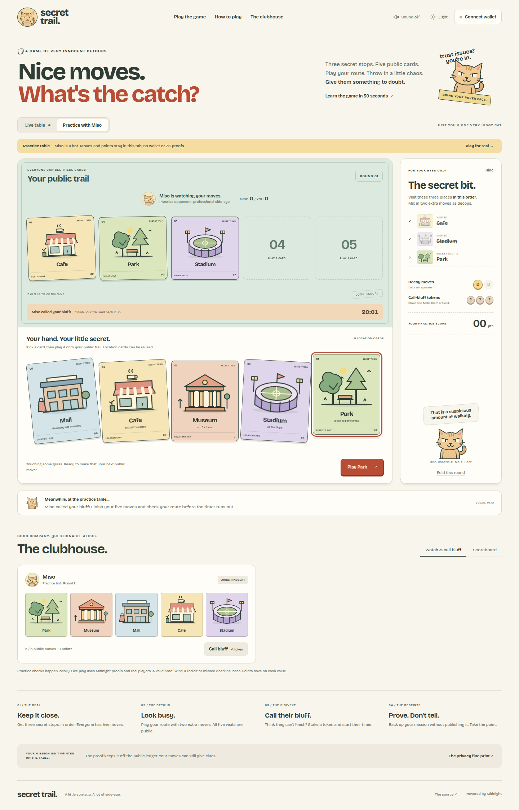

# Secret Trail


> A multiplayer bluffing game where everyone sees your moves, but only you know which stops fulfill your secret mission.

**Release status:** Secret Trail Level 1 is deployed on Midnight Preprod and served from [Vercel](https://midnight-secret-trail.vercel.app/). The contract is reachable through the Preprod indexer. A complete two-wallet challenge round has not yet been verified on-chain.



[Mobile card table](screenshots/secret-trail-mobile.png) · [Dark theme](screenshots/secret-trail-dark.png). These interface captures show the explicitly labelled local practice mode; they are not evidence of on-chain transactions.

## Live Demo

[Play Secret Trail](https://midnight-secret-trail.vercel.app/). The public board reads the live V2 Preprod contract. To submit wallet transactions with Lace, follow the proof-server instructions below.

**No wallet yet?** Choose **Practice with Miso** to learn the game against a local cat opponent. Practice moves and points stay in the current tab and never generate a ZK proof or submit a transaction. Switch to **Live table** for the real Preprod game.

A dedicated Secret Trail product X profile and a one-minute video of its full wallet flow have not been published yet.

## Contract Address

| Version | Network | Address | Status |
| --- | --- | --- | --- |
| Secret Trail V2 | Preprod | [`61eafc2202ab691039994916cf4f5821dd97eee8df489872862aee472f79cc63`](https://preprod.midnightexplorer.com/contracts/0x61eafc2202ab691039994916cf4f5821dd97eee8df489872862aee472f79cc63) | Deployed and connected to Vercel |
| Secret Missions V1 | Preprod | [`41faea462a257e1f01f171eea6a279e2746cc4165a80e0ba5d05b6fc5c5cda7e`](https://preprod.midnightexplorer.com/contracts/0x41faea462a257e1f01f171eea6a279e2746cc4165a80e0ba5d05b6fc5c5cda7e) | Earlier contract, no longer used by the site |

Never point the Secret Trail frontend at the V1 address. The two contracts have different ledger schemas and circuits.

## What This Does

Each player receives one of eight private three-stop routes through Museum, Cafe, Stadium, Park, and Mall. They make exactly five public visits. The three mission stops must occur in order; the remaining two visits can be decoys. A commitment to the mission is recorded before the first visit, and a zero-knowledge proof verifies the route at the end without revealing the mission number or labeling the decoys.

Other registered players can watch a run after its first move and spend one of their three challenge tokens to challenge it. The runner then has a 20-minute deadline to finish five moves and prove the route. A valid proof gives the runner one point and burns the challenger's staked token. If the runner forfeits or misses the deadline, the challenger gets one point and their token back. Any registered player may settle an expired challenge for the original challenger. A settled player can start a fresh round with a new private mission and salt.

Challenge tokens and points have **no monetary value**. Level 1 is implemented here. Levels 2–4—longer routes, extra decoys, time constraints, and branching missions—are planned, not playable yet.

### Playing at the card table

1. Choose **Live table**, connect Lace, return to the table and click **Deal me in**. Approve the transaction to commit your mission.
2. Read the three private location cards under **The secret bit**. Use **Hide / Peek** if someone is looking at your screen.
3. Select a location card from your hand and click **Play [location]**. Each visit becomes public only after the wallet transaction is confirmed. Complete the three secret stops in order and add two other visits, for exactly five moves.
4. Click **Prove it. Take the point.** A valid proof earns one point. **Deal next round** gives you a fresh mission after the run settles.
5. In **The clubhouse**, watch other real players and **Call bluff** to stake a token. Confirming the challenge starts their proof deadline. **Fold this round** also asks for confirmation before ending your run.

Every player has the same five-move budget and the same five reusable location cards; their display order is shuffled on each deal. This card-table version keeps Secret Trail's committed-route rules: location cards are not removed from another player's hand, and rounds award points rather than declaring a last-card winner. Real players make their moves independently; there is no turn-based lobby or shared draw pile in this contract.

The light theme is the default. The header provides a persistent light/dark toggle and optional original arcade sound effects (off by default). Card animations respect reduced-motion settings. The cat illustrations and location art are original SVGs; the font is self-hosted with its licence in `public/fonts/OFL.txt`.

### Practice with Miso

Practice deals a random mission immediately and checks the same ordered-route rule locally. Miso challenges you after your third move and demonstrates both challenge outcomes across rounds. The banner, score and result messages label this as practice. Practice scores never enter the live leaderboard, and refreshing the page resets the practice game.

## Privacy Model

- **PUBLIC:** player ID, round, mission commitment, every location visited and its order, run/challenge status, challenger ID, deadline, score, and challenge-token balance.
- **PRIVATE:** identity secret, mission number, random commitment salt, and which visits the player intends as decoys. These live in the player's browser and are supplied as private witnesses for proving.
- **PROVED without revealing:** the committed mission's three locations occurred in order within the five public visits, before the challenge deadline when challenged.

## Privacy Claim

An on-chain observer sees the entire five-visit trail and whether a proof succeeded. The contract does not publish the secret mission or decoy labels. Observers can still **infer** possible missions from the trail; some trails may fit only one of the eight templates. The game hides the witness from the ledger, not every clue from other players.

A hosted prover may receive private proving inputs. The prototype stores the player's secret and mission in browser local storage; someone with access to that browser profile can read them, and clearing storage loses the ability to act as that player. A modified browser can choose its mission before joining, so the current proof establishes completion of a **committed** mission, not fair mission assignment. Multiple browser identities can also manipulate a leaderboard; no financial rewards should depend on this version.

## Tech Stack

Compact smart contract and Midnight Preprod; React 19, TypeScript, Vite 7; Midnight.js 4.1; Lace wallet connector; local or configured hosted proof server. The new contract is [`contracts/secret-trail.compact`](contracts/secret-trail.compact), with generated proving assets in `managed/secret-trail`. The previous V1 contract remains in the repo for reference.

## Prerequisites

- Node.js 22 and npm.
- Compact CLI 0.5.2 with compiler 0.31.1; see the [Compact installation guide](https://docs.midnight.network/compact/compilation-and-tooling).
- Lace with Midnight Preprod enabled, usable tDUST, and a working proof service.
- The deployed Secret Trail Preprod contract address shown above for live transactions.

## Setup & Run Locally

```bash
git clone https://github.com/ashuujha/midnight-secret-trail.git
cd midnight-secret-trail
npm ci
npm run compile
cat > .env.local <<'EOF'
VITE_MIDNIGHT_NETWORK=preprod
VITE_CONTRACT_ADDRESS=61eafc2202ab691039994916cf4f5821dd97eee8df489872862aee472f79cc63
VITE_PROOF_SERVER_URL=https://midnight-counter-prover.onrender.com
EOF
npm run dev
```

Open the Vite URL. Try **Practice with Miso** immediately, or choose **Live table**, connect Lace, click **Deal me in**, play five cards, and prove your route. For two-player testing, use distinct browser profiles and wallets to issue a challenge between visits. A wallet transaction is required for every visit; keep the tab open through proof generation, Lace approval, and Preprod confirmation.

The app can also deploy a new contract from its **Deploy with Lace** button in local development when `VITE_CONTRACT_ADDRESS` is unset. After deployment, record the address and reload. Do not reuse the V1 address. Alternatively, `npm run deploy:preprod` uses the [deployment script](deploy/deploy.ts) and a separately funded Preprod wallet; its ignored `.midnight-state.json` contains recovery data and must stay private.

Lace 2.4 may expose only a **Local** proof server at `http://localhost:6300`. In that case, run `npm run proof:bridge` in a separate local terminal while using Lace. The bridge forwards Lace's `/check` and `/prove` requests to the hosted Render prover. This sends wallet proving data to that service and only works while the bridge is running. The app's `VITE_PROOF_SERVER_URL` setting does not change Lace's own server used for transaction balancing. The free Render service can sleep after inactivity, so the first proof may take longer despite asset prefetching; see [Render's free-service behavior](https://render.com/docs/free#spinning-down-on-idle).

## Run Tests

```bash
npm test
npm run build
npm run typecheck:deploy
```

The 24-test suite checks the earlier contract, the challenge and replay rules, proving-asset caching, UI route parity with the deployed circuit, and practice wins, losses, token settlement and round resets. Browser checks also cover card selection, mission hide/peek, confirmation dialogs, wallet-unavailable messages, theme/sound preferences and responsive layouts from 320px to 1440px. `npm run check` recompiles the new contract and runs all of these checks.

## CI/CD

[GitHub Actions](.github/workflows/ci.yml) runs on pushes to `main` and pull requests. It installs Node 22 and the Compact compiler, compiles the Secret Trail contract, runs tests, builds the production app, and typechecks the deployment script. The [V2 pull request passed CI](https://github.com/ashuujha/midnight-secret-trail/actions/runs/36182024283), and the badge above reflects the current `main` branch.

## Product Proposal

The [product proposal](PROPOSAL.md) explains the player experience, Midnight privacy requirement, data model, and Mainnet work.

## Demo Video

A one-minute **Secret Trail** recording is still needed: connect Lace; show a private route; make five public visits with two decoys; have another player challenge the run; generate a valid proof; show the runner's point and the challenger's lost token. The earlier [counter video](https://youtu.be/Xa65AHEurZg) demonstrates a different dApp and is not this game's video.

## Submission Checklist

- ✓ Public GitHub repository and full documentation on `main`.
- ✓ Compact contract compiles and local gameplay tests pass.
- ✓ CI workflow and badge present; V2 pull-request run passed.
- ✓ New Secret Trail Preprod contract and [live V2 URL](https://midnight-secret-trail.vercel.app/).
- ✗ Full two-wallet live playthrough and game video.
- ✗ Dedicated product X profile link.
- ✓ At least 15 meaningful commits exist in the repository.
