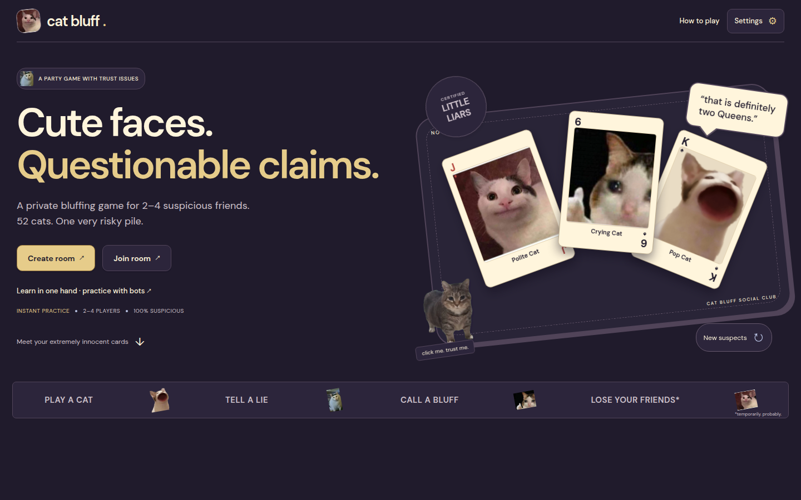
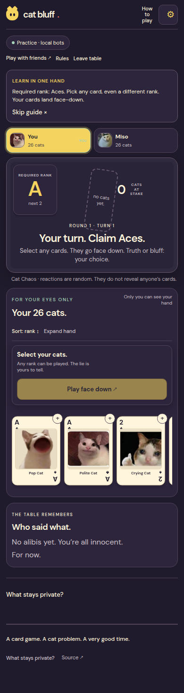

# Cat Bluff


> Cute faces. Questionable claims. A private bluffing card game for 2–4 suspicious friends on Midnight.

**Cat Bluff Classic 52** uses one ordinary 52-card deck with a different cat image on every physical card. You know your own hand; everyone sees the required rank, the claims, and the growing face-down pile. Play your cards, decide whether to trust your friends, and call **BLUFF!** when the risk feels worth it.

**Release status:** The Classic 52 contract is deployed on Midnight Preprod and its public beta is online. Local practice and the compiled-circuit test suite work. A complete two-wallet Preprod round has **not yet been verified**, so the short product trailer is not presented as a live multiplayer demo.



[Play Classic 52 beta](https://cat-bluff-classic52-beta.vercel.app/) · [Product X: @catbluffgame](https://x.com/catbluffgame) · [Source code](https://github.com/ashuujha/cat-bluff/tree/feature/classic-52)

## Contents

- [Live Demo](#live-demo)
- [Contract Address](#contract-address)
- [What This Does](#what-this-does)
- [Privacy Model](#privacy-model)
- [Privacy Claim](#privacy-claim)
- [Tech Stack](#tech-stack)
- [Prerequisites](#prerequisites)
- [Setup & Run Locally](#setup--run-locally)
- [Run Tests](#run-tests)
- [CI/CD](#cicd)
- [Product Proposal](#product-proposal)
- [Screenshots](#screenshots)
- [Demo Video](#demo-video)
- [Submission Checklist](#submission-checklist)

## Live Demo

| Experience | Link | What it offers |
| --- | --- | --- |
| **Classic 52 public beta (V4)** | [cat-bluff-classic52-beta.vercel.app](https://cat-bluff-classic52-beta.vercel.app/) | The 52-card game, guided local practice, and Lace-powered Preprod rooms. This is the version documented below. |
| Earlier Cat Bluff game (V3) | [cat-bluff-ashuu.vercel.app](https://cat-bluff-ashuu.vercel.app/) | The existing five-cat game. Its contract and rooms are separate from Classic 52. |
| Source code | [`feature/classic-52` branch](https://github.com/ashuujha/cat-bluff/tree/feature/classic-52) | Current Classic 52 source, tests, assets, and this guide. |

**Try it without a wallet:** choose **Learn in one hand**, select 2, 3, or 4 players, and deal against local bots. Practice is a teaching mode; it creates no proofs or blockchain transactions. Choose **Step by step** to advance every bot action yourself or **Relaxed auto** for a slower automated pace.

**Play with friends:** choose **Create room**, connect Lace on Preprod, and copy the invite link for 1–3 friends. Each friend joins with a separate wallet and browser profile. The host can start with 2, 3, or 4 seats; each player then contributes to the private shuffle and deal. The invitation contains public room and contract IDs, never a hand or table key.

Live setup and moves wait for real proofs, Lace approval, and network confirmation. The UI shows those stages and keeps the table visible; practice is the fast way to learn while friends are getting their wallets ready.

## Contract Address

| Version | Network | Contract address | Status |
| --- | --- | --- | --- |
| **Classic 52 V4** | Midnight Preprod | [`616618c2dd897208bc75fdf25a912fad5567d97935d002a199b8a528b1def946`](https://preprod.midnightexplorer.com/contracts/0x616618c2dd897208bc75fdf25a912fad5567d97935d002a199b8a528b1def946) | Deployed; schema 4 and ten verifier keys checked. Configured in the Classic 52 beta. |
| Earlier Cat Bluff V3 | Midnight Preprod | [`3cc6418a04b9d1e6deab06e5711e4e3c3876e697ba412202f932ebe030bc917e`](https://preprod.midnightexplorer.com/contracts/0x3cc6418a04b9d1e6deab06e5711e4e3c3876e697ba412202f932ebe030bc917e) | Separate five-cat rules and existing rooms. |

The recorded V4 deployment is at Preprod block **2,715,402**, transaction `065011fb07056ea87e768428697ed0f5bd27cd6846b69e2f3fae77b380866591`. A **read-only indexer check on 26 September 2026** returned this contract's latest indexed action at block **2,719,995**, transaction `025063b7c8b7f2d3c4989880720c32dec25781944cf0135478629408b8be3dde`. That latest-action snapshot can change; it confirms contract activity, not a completed multiplayer round.

Reproduce the public-address check:

```bash
curl --fail-with-body --silent --show-error \
  https://indexer.preprod.midnight.network/api/v4/graphql \
  -H 'Content-Type: application/json' \
  --data-raw '{"query":"query Verify($address: HexEncoded!) { contractAction(address: $address) { address transaction { hash block { height } } } }","variables":{"address":"616618c2dd897208bc75fdf25a912fad5567d97935d002a199b8a528b1def946"}}'
```

A Vercel frontend deployment does not deploy a Compact contract. V3 and V4 use different schemas and must keep their addresses in the matching environment variables.

### Classic 52 circuit flow

| Stage | Public V4 circuits | Purpose |
| --- | --- | --- |
| Room | `createRoom`, `joinRoom`, `startRound` | Seat 2–4 players and begin a round |
| Private deal | `shuffleDeck`, `shareDeal` | Jointly re-randomize the encrypted deck and deliver each hand |
| Claim | `playCards`, `passClaim`, `callBluff` | Submit physical card slots and collect ordered responses |
| Resolution | `revealTurn`, `transferPile` | Open only the challenged play and move the penalty pile privately |

## What This Does

Cat Bluff is the familiar **Cheat / Bluff** decision in a cat-meme deck: *“I think you are lying, but if I call it and I am wrong, I take the whole pile.”* The cat image makes a card memorable; the printed **rank** is its actual game identity.

1. **Deal all 52 cards.** There are 13 ranks (A, 2–10, J, Q, K) and exactly four physical cards of each rank. Two players receive 26 each; three receive 18/17/17; four receive 13 each. Every card exists once.
2. **Follow the required rank.** Claims advance A → 2 → … → K → A. Everyone knows what rank the active player must *claim*.
3. **Play face down.** Select one or more cards from your own hand, including cards of the “wrong” rank. If the rank is Queen and you submit two cards, your public claim is **“2 Queens.”** It might be true, partly true, or a complete bluff.
4. **Trust or call BLUFF.** Opponents respond in seat order. If all trust, those cards remain face down and the pile grows. A trusted claim is **not** proof that it was true.
5. **Settle a challenge.** A challenge reveals only the cards submitted on that turn. If any card was not the claimed rank, the player who bluffed takes the **entire** pile. If every card matches, the challenger takes it. Earlier unchallenged cards are not opened just because the pile moves.
6. **Finish the last claim.** Playing your final card is not an instant win. Opponents still get their chance to challenge; a caught final bluff sends the pile back to the player. The host can start another round after a winner is settled.

The interface shows your own cards, the other players' card counts, the required rank, the latest claim, pile size, and public history. You can select multiple cards, sort or expand a large hand, inspect your own cards, and use a mobile layout. **Cat Chaos** adds a brief random cat reaction after a play. Its image and sound are selected independently of the played cards and whether the claim is true; they are entertainment, not a hint. Theme, game-sound, meme-sound, and motion controls are available.

There are no stakes, coins, NFTs, card powers, or artificial turn delays. The growing pile supplies the tension.

## Privacy Model

| Data or action | Public or private? | Who can learn it? |
| --- | --- | --- |
| Room ID, pseudonymous seats, public encryption keys | Public ledger | Everyone |
| Encrypted deck, opaque card slots and their owners | Public ledger | Everyone sees ciphertext and slot movement, not the plaintext hand |
| Hand counts, required rank, claim quantity, pile size, responses, history, winner | Public ledger | Everyone |
| Cards submitted on a **challenged** turn | Deliberately revealed | Everyone after resolution |
| Remaining hand, unchallenged plaintext cards, identity/encryption secrets | Private browser state and proving witnesses | The player; also a selected remote prover if one is used |
| Shuffle permutation, blinding values, private deal and pile-transfer inputs | Private witnesses | The contributing player and their selected prover |
| Valid shuffle, ownership, challenged opening, and pile transfer | Proved by Compact circuits | The network verifies validity without receiving the rest of a plaintext hand |
| Cat Chaos reaction | Local presentation | The current viewer; it does not use hidden game data |

Each player contributes a shuffle and re-encryption to the shared encrypted deck. Each then helps remove encryption layers from the cards assigned to other players, while the recipient's layer remains. Recipients open only their own hands locally; there is no hosted dealer with the complete plaintext deck.

The browser and Lace submit signed circuit transactions directly to Midnight Preprod. Vercel serves the React app and a **public-read-only** `/api/table` endpoint for current room updates. That endpoint accepts only the configured contract/network and a public room ID; it does not receive wallet secrets, proof inputs, or plaintext hands. Proof generation uses the player's configured prover, which is a separate trust boundary.

## Privacy Claim

An on-chain observer can see **who claimed how many cards of the required rank, who trusted or challenged, how the encrypted slots moved, and which cards opened during a challenge**. The observer cannot read an unchallenged card or the remaining plaintext hand directly from the public ledger. Public counts, slot tracking, earlier reveals, and colluding players may still support deductions.

**Two-player limit:** because all 52 cards are dealt, a player who knows their own starting hand can infer the opponent's starting hand as its complement. The selected face-down cards can remain uncertain, but this mode does not promise an unknowable starting hand. Three or four players offer more uncertainty.

Privacy also depends on at least one honest, unpredictable shuffle contribution and on keeping browser keys private. The circuit proves a valid permutation, not that a player chose good randomness. Private table keys are scoped locally to the wallet, contract, and room; clearing browser storage or changing browser profile/site origin may make a hand unrecoverable. A **remote proof service sees private proving inputs**, potentially including table keys. Use a compatible local prover if those inputs must stay on your device. A localhost bridge to a hosted service is still remote proving. The protocol has not received an independent security audit.

The frontend loads the full 52-card art catalog together, so an image request does not identify which private card a player holds. Cat Chaos reactions are selected locally without reading card identity or truthfulness.

## Tech Stack

| Layer | Technology |
| --- | --- |
| Smart contracts | Compact compiler 0.31.1; Classic 52 schema 4 with ten public circuits |
| Blockchain | Midnight Preprod |
| Wallet and client | Lace / Midnight DApp Connector API 4.0.1; Midnight.js 4.1.1 |
| Runtime | `@midnight-ntwrk/compact-runtime` 0.16.0; Compact.js 2.5.1 |
| Frontend | React 19.2.4, TypeScript 5.9.3, Vite 7.3.1, custom CSS |
| Assets | 52 distinct cat card images, local fonts, browser-synthesized game cues and short meme clips |
| Tests and CI | Node test runner through `tsx`; GitHub Actions with Node.js 22 |
| Hosting | Vercel static frontend and public-room read function |

## Prerequisites

- **For practice:** a modern browser. No wallet, DUST, prover, or network transaction is needed.
- **For local development:** Node.js 22.x, npm, and [Compact CLI 0.5.2](https://docs.midnight.network/compact/compilation-and-tooling) with compiler **0.31.1**.
- **For live play:** Lace with Midnight Preprod selected, a synchronized wallet, registered tNIGHT for DUST generation, a positive tDUST balance, and a compatible proof server in the wallet's settings.
- **For a real multiplayer check:** at least two distinct Lace wallets/browser profiles. Every player must remain available during joint setup and required pile transfers.

## Setup & Run Locally

Clone the Classic 52 branch, install dependencies, and compile both the compatibility and Classic 52 contracts:

```bash
git clone --branch feature/classic-52 https://github.com/ashuujha/cat-bluff.git
cd cat-bluff
npm ci
compact update 0.31.1
npm run compile
```

Create `.env.local` using **public build configuration only**:

```bash
cat > .env.local <<'ENV'
VITE_MIDNIGHT_NETWORK=preprod
VITE_CAT_BLUFF_CONTRACT_ADDRESS=3cc6418a04b9d1e6deab06e5711e4e3c3876e697ba412202f932ebe030bc917e
VITE_CLASSIC_CONTRACT_ADDRESS=616618c2dd897208bc75fdf25a912fad5567d97935d002a199b8a528b1def946
ENV
npm run dev
```

Open the URL Vite prints (normally `http://localhost:5173`). **Learn in one hand** starts practice immediately. For Preprod play, create a room with Lace, share its invite link, join from another wallet, and let each player complete their shuffle and deal-share turns. The host can then begin the first claim. Invitations for earlier V3 rooms still open their separate game.

| Variable | Purpose |
| --- | --- |
| `VITE_MIDNIGHT_NETWORK` | Network requested from Lace; use `preprod` here |
| `VITE_CLASSIC_CONTRACT_ADDRESS` | Deployed Classic 52 V4 contract |
| `VITE_CAT_BLUFF_CONTRACT_ADDRESS` | Earlier V3 contract, retained for existing rooms |
| `VITE_CLASSIC_PROOF_SERVER_URL` | Optional compatible prover for V4; omit to use Lace's configured prover |

All `VITE_*` values are embedded into the browser build. **Never put a wallet seed, signing key, password, or private table key in them.** Restart Vite after changing local configuration; rebuild a hosted frontend after changing its variables. The site's prover variable does **not** change Lace's own proof-server setting or wallet fee balancing.

A real device-local prover must be running if Lace points to `http://localhost:6300`. The optional `npm run proof:bridge` forwards to a hosted service and sends private inputs there. It is not a device-private substitute. For a separate V4 contract, the UI offers **Set up live play → Connect Lace → Deploy Classic 52 with Lace**; a wallet signature is required. The older command-line deploy helper targets V3.

### Troubleshooting

| Symptom | What to check |
| --- | --- |
| Lace does not open or connection is rejected | Unlock Lace, enable Midnight/Preprod, review site permission, then reconnect or reload the extension. |
| No tDUST or fee balancing fails | Complete **Generate tDUST**, wait for a positive DUST balance and wallet sync, and verify Lace's own proof-server setting. |
| `localhost:6300` fails | Run a compatible local proof server or change Lace's setting. A hosted site cannot reach a stopped prover on your computer. |
| Proof or submission times out | Check Lace activity and the public room state before retrying; the first transaction may already have landed. |
| You cannot reopen your hand | Return with the same wallet, browser profile, and site origin. Clearing local browser state can remove the private key. |
| A room is waiting during shuffle, deal, or pickup | The indicated player's signed contribution is needed; this release cannot force an absent player to finish. |
| Cards seem revealed by a cat reaction | Cat Chaos is random and separate from card artwork. Only a challenge opens the submitted cards. |

## Run Tests

```bash
npm test
npm run build
npm run typecheck:deploy
npm run test:load
# Or run the compile, test, build, and deployment-typecheck sequence:
npm run check
```

**Verified locally on 26 September 2026:** `npm test` completed **107 tests across 14 suites, 0 failures**. Tests cover the compiled V4 circuits; 2-, 3-, and 4-player card conservation; invalid shuffles; ownership; truthful and false claims; full-pile penalties; final-card settlement; rematches; private-state recovery; wallet errors; Cat Chaos; and public-read behavior. `npm run check` and the Vercel production build passed for the current game code.

The [saved test-output image](screenshots/classic52-tests.png) is an **earlier 79-test run**. Run `npm test` for the current 107-test result. These are local tests and do not establish a completed wallet-to-wallet Preprod round. Browser checks also covered the 1440 px desktop and 390 px mobile layouts, card selection, practice pacing, light/dark themes, sound, and reduced motion.

An optional synthetic-state proof benchmark is available with `npm run benchmark:proof` and a compatible local prover on port 6301. It submits no transactions and excludes Lace and network latency.

### Public-read capacity

`npm run test:load` simulates **100 local HTTP readers**, with compiled-contract room fixtures and a simulated 100 ms indexer. The recorded runs on 26 September 2026 each sent 800 requests over about 29 seconds:

| Players per room | Rooms | Request errors | Upstream indexer reads | Read latency, 95th percentile |
| --- | ---: | ---: | ---: | ---: |
| 2 | 50 | 0 | 8 | 859 ms |
| 3 | 34 | 0 | 8 | 808 ms |
| 4 | 25 | 0 | 8 | 621 ms |

The public-read function coalesces in-flight requests and caches a ledger read briefly; active tabs poll about every 4–5 seconds, while hidden/offline tabs pause and failures back off.

This measures one local read service, **not** 100 wallets generating proofs or sending transactions. Cache entries are per Vercel function instance, so real traffic may create more upstream reads. Prover capacity, DUST, Preprod throughput, and end-to-end move time still require a staged live test.

## CI/CD

The [GitHub Actions workflow](.github/workflows/ci.yml) runs on pushes to `main` and on pull requests. It checks out the code, installs Node.js 22 and dependencies, installs Compact CLI 0.5.2/compiler 0.31.1, compiles both contracts, runs `npm test` and the local 100-reader simulation, builds the dApp, and typechecks deployment tooling. The badge below the title reports **main**; its latest checked run was successful on 26 September 2026. Pushes to `feature/classic-52` alone do not trigger that main workflow.

Vercel builds the app with `npm run build:vercel` and serves `dist/`. Compiled V4 proving assets are copied under `/classic52/`. The [Classic 52 beta](https://cat-bluff-classic52-beta.vercel.app/) is a **separate Vercel project** from the [current main live game](https://cat-bluff-ashuu.vercel.app/). The beta was deployed from the Classic 52 source; future beta changes require another deployment. The serverless `/api/table` function serves bounded public room snapshots only; gameplay transactions still go through each player's Lace/Midnight connection.

## Product Proposal

[PROPOSAL.md](PROPOSAL.md) covers the product and users, why Midnight is needed, the public/private data model, and a bounded Mainnet feasibility plan. It identifies Cat Bluff as a **Consumer & Social / Gaming** product. A Mainnet pilot still depends on complete live rounds, measured proving cost and latency, disconnect recovery, and an independent security review. Program approval of this revised card mechanic has **not** been recorded in this repository.

## Screenshots

These show the real current UI in **local practice**. They do not depict a fabricated wallet transaction or a verified multiplayer win.

| View | Capture |
| --- | --- |
| Clubhouse landing | [Desktop welcome](screenshots/clubhouse-home.png) |
| Game table | [Desktop Classic 52 table](screenshots/classic52-table.png) |
| Phone layout | [390 px Classic 52 table](screenshots/classic52-mobile.png) |
| Alternative theme | [Dark clubhouse table](screenshots/classic52-dark.png) |
| Tests | [Archived 79-test output](screenshots/classic52-tests.png) |




## Demo Video

**Full gameplay demo URL:** _To be added after recording a complete two-wallet Classic 52 Preprod round._

A [22-second product trailer](public/media/cat-bluff-launch.mp4) and [poster](public/media/cat-bluff-launch.jpg) are already available. The trailer shows local practice and the trust-or-BLUFF moment; **it is not proof of a completed live multiplayer round**. Music attribution is in [Media Credits](#media-credits).

For the full demo, record: connect two Lace wallets → create and invite to a room → both players shuffle and share the deal → show each private hand separately → submit a face-down claim → trust or call BLUFF → reveal only that turn's cards → transfer the whole pile to the correct player → show a confirmed transaction receipt. Show the current test output and CI badge separately. If proofs take time, label any edited wait accurately and keep private keys and recovery material out of the recording.

## File Structure

```text
.github/workflows/ci.yml        CI for main pushes and pull requests
contracts/cat-bluff52.compact   Classic 52 V4 contract
contracts/cat-bluff.compact     Earlier V3 compatibility contract
src/components/ClassicGame.tsx  Lobby, practice, live table and round states
src/game/                    Card catalog, rules, invites and Cat Chaos
src/midnight/classic52.ts      V4 wallet/proof/contract client
src/hooks/useClassic52.ts      Live room state and transaction progress
server/table-service.ts        Bounded, cached public-room reads
api/table.ts                  Vercel read-only endpoint
tests/                       Contract, rules, privacy, recovery and read tests
screenshots/                 Actual UI and archived test-output captures
public/media/                Product trailer and poster
PROPOSAL.md                  Product, Midnight rationale and Mainnet scope
README.md                    This guide
```

## Submission Checklist

| Requirement | Status / evidence |
| --- | --- |
| Public repository and full README | ✓ [Classic 52 branch](https://github.com/ashuujha/cat-bluff/tree/feature/classic-52), setup, usage, rules and privacy documentation |
| Live demo and Preprod address | ✓ [Public beta](https://cat-bluff-classic52-beta.vercel.app/) and [V4 contract](#contract-address); **full multiplayer round still unverified** |
| Tests | ✓ 107 local tests passed, 0 failed; [older test screenshot](screenshots/classic52-tests.png) shows 79 |
| CI workflow and badge | ✓ [Workflow](.github/workflows/ci.yml) and green `main` badge; current beta branch is separately validated locally |
| Product X profile | ✓ [@catbluffgame](https://x.com/catbluffgame) |
| Gameplay demo video | ✗ URL intentionally left open above; a practice-only trailer exists |
| Minimum 15 meaningful commits | 59 commits in this branch's history at documentation time; reviewers should assess the substance of the commits |

## Media Credits

Image, audio and font sources are recorded in [public/media-credits.json](public/media-credits.json). Third-party cat-meme media retains its original rights and is not covered by the code license; permissions need review before a broader commercial release. Browser-synthesized game cues are separate from meme clips. The product trailer adapts [“Happy Beats & Business Moves Vol. 12” by Sascha Ende](https://ende.app/en/song/12881-happy-beats-business-moves-vol-12) under [CC BY 4.0](https://creativecommons.org/licenses/by/4.0/).

## License

Code is distributed under the [MIT License](LICENSE). © Ashutosh Jha.
