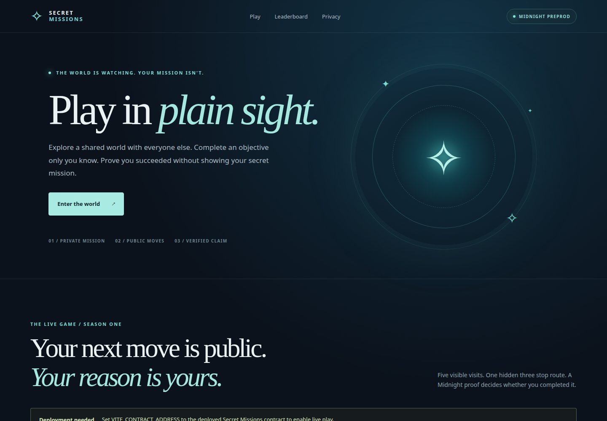
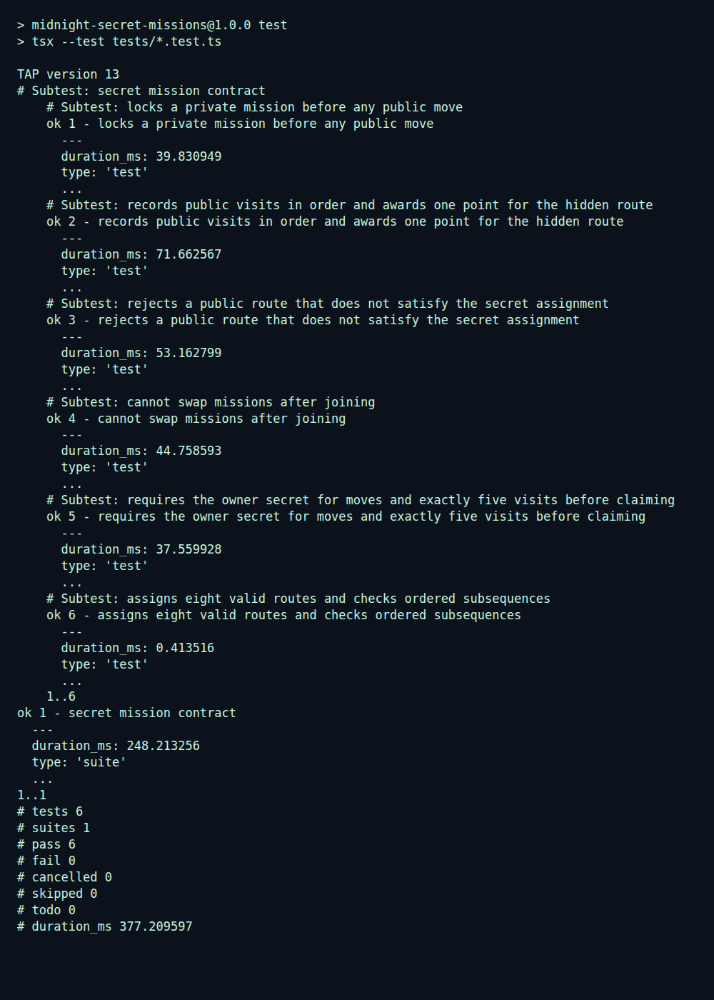

# Secret Missions


> A multiplayer Midnight game where everyone sees your moves, but your mission stays private until a proof earns your point.

Secret Missions is a [separate public project](https://github.com/ashuujha/midnight-secret-missions) built from the working wallet and proof integration in the [Midnight Private Counter](https://github.com/ashuujha/midnight-private-counter). Its own contract is deployed on Midnight Preprod. The counter's contract address is not reused.



The [mobile preview](screenshots/mobile-preview.png) shows the responsive first screen. Both captures were taken locally before the new contract was deployed.

## Live Demo

[Play Secret Missions on Vercel](https://midnight-secret-missions.vercel.app/). The public world and leaderboard load from the deployed Midnight Preprod contract.

The dedicated Secret Missions X profile is being created. Its link will be added here once public.

To submit moves, connect a funded Preprod Lace wallet, receive a mission, and make five public moves before claiming. Lace 2.4 may offer only a Local proof server; in that case, the wallet needs a prover on the player's own `localhost:6300`. The hosted site and Render prover do not change that wallet setting.

The site starts waking the hosted prover when the page opens and caches each circuit's downloaded proving files for the current tab. This reduces the wait for repeat visits. The free Render instance still sleeps after inactivity, and proof computation, Lace balancing, and Preprod confirmation still take time. Keep the tab open until the result appears. [Render documents its free-service wake-up delay](https://render.com/docs/free#spinning-down-on-idle).

## Contract Address

| Network | Address | On-chain record |
| --- | --- | --- |
| Preprod | `41faea462a257e1f01f171eea6a279e2746cc4165a80e0ba5d05b6fc5c5cda7e` | [View contract on Midnight Explorer](https://preprod.midnightexplorer.com/contracts/0x41faea462a257e1f01f171eea6a279e2746cc4165a80e0ba5d05b6fc5c5cda7e) |

The Preprod indexer returned this contract's public ledger with `playerCount = 0` and `completedMissions = 0` immediately after deployment. The first wallet join and claim still need a live transaction test.

## What This Does

Players connect a Midnight-enabled Lace wallet and join a shared world. The browser creates a random 32-byte player secret and selects one of eight three-stop missions. The contract records a player ID and a commitment to the mission **before** any moves. Each player then submits five public visits to Harbor, Library, Observatory, or Market. The mission's three stops must appear in order; the two remaining visits may be decoys. A final claim circuit checks the hidden mission against the public visits and awards one public leaderboard point. Every join, visit, and claim is a signed Midnight transaction.

This first season is asynchronous: players compete on a shared leaderboard without a timer or financial prizes. Each identity can join once and claim one point. The game is meant to demonstrate public action plus private intent; it is not yet a hardened esports or wagering system.

## Privacy Model

- **PUBLIC:** player ID, mission commitment, ordered visits, claimed status, scores, and transaction activity.
- **PRIVATE:** the player's random secret and mission number are held by the browser and supplied as private witnesses during proving. The secret is saved in this browser's local storage so play can continue after a reload.
- **PROVED without revealing:** that the mission fixed at join time appears as an ordered subsequence of the five public visits and has not already earned a point.

## Privacy Claim

An on-chain observer can see where a player went, when they submitted transactions, and whether they earned a point. The contract does not publish which of the eight missions the player held, and a successful claim does not reveal the mission number. A route may still let an observer **infer** the mission, especially when the visits match only one possible objective. Privacy is therefore about hiding the mission witness from the ledger, not guaranteeing that gameplay never gives clues.

The selected prover is another trust boundary. A hosted proof service may receive private proving inputs; use a prover you trust if the mission must remain unknown to the service operator. The secret is stored in plain local storage for this prototype, so anyone with access to the browser profile can recover it. Clearing browser storage loses the player's ability to make further moves or claim their point.

## Fairness and Current Scope

The browser chooses the mission randomly for honest players, and the ledger commitment prevents changing it after joining. A modified client can choose its own mission before joining. The current proof establishes **completion of the committed mission**, not fair mission assignment. A production competitive version will add a commit-then-randomize round setup, wallet or credential binding, mission recovery, and explicit round deadlines before introducing prizes.

## Tech Stack

Compact smart contract and Midnight Preprod; React 19, TypeScript, Vite 7; Midnight.js 4.1; Lace wallet connector; local or configured hosted proof server. The contract is in [`contracts/secret-missions.compact`](contracts/secret-missions.compact), and generated proving assets live in `managed/secret-missions`.

## Prerequisites

- Node.js 22 and npm.
- Compact CLI 0.5.2 with compiler 0.31.1. [Compact installation guide](https://docs.midnight.network/compact/compilation-and-tooling).
- Lace with Midnight Preprod enabled, tNIGHT registered to generate tDUST, and a working proof service. The configured proof server must support the three compiled circuits (`join`, `visit`, `claim`).
- A deployed Secret Missions contract address for live transactions.

## Setup & Run Locally

```bash
git clone https://github.com/ashuujha/midnight-secret-missions.git
cd midnight-secret-missions
npm ci
npm run compile
cat > .env.local <<'EOF'
VITE_MIDNIGHT_NETWORK=preprod
VITE_CONTRACT_ADDRESS=41faea462a257e1f01f171eea6a279e2746cc4165a80e0ba5d05b6fc5c5cda7e
VITE_PROOF_SERVER_URL=https://midnight-counter-prover.onrender.com
EOF
npm run dev
```

Open the URL printed by Vite. Connect Lace, receive a mission, record five visits, and claim. If `VITE_PROOF_SERVER_URL` is omitted, the app delegates circuit proving to Lace's configured provider. A site-level hosted prover setting does not change Lace's own proof server used for transaction balancing.

If **Deploy with Lace** fails while a `/check` request is pending or fails, inspect the proof-server URL in Lace's Midnight settings. Deployment has no game-circuit proof to send through the dApp's provider; Lace uses its own configured prover to balance the transaction. In Lace 2.4, **Settings → Midnight Settings → Proof Server** may show only **Local**. That points to `http://localhost:6300` and cannot be changed to an arbitrary URL in that screen. For local testing without Docker, run `npm run proof:bridge` in a separate terminal. This binds only to local port 6300 and forwards `/check` and `/prove` to the shared [Render prover](https://midnight-counter-prover.onrender.com/ready). Keep that terminal running while using Lace. The bridge passes wallet proving data to Render and works only while this computer is on; it does **not** make the hosted dApp usable by other Lace users whose wallets are also Local-only. The dApp's separate `VITE_PROOF_SERVER_URL` does not change Lace. If `/check` still fails, note its HTTP status and host.

## Run Tests

```bash
npm test
npm run build
```

The eight-test suite covers mission commitment, ordered visits, successful scoring, wrong routes, mission swapping, duplicate claims, invalid actions, and proving-asset cache behavior.



## CI/CD

[GitHub Actions](.github/workflows/ci.yml) runs on pushes to `main` and pull requests. It installs Node 22 and the Compact compiler, compiles the contract, runs tests, builds the production dApp, and checks the deployment script. The [first main-branch run passed](https://github.com/ashuujha/midnight-secret-missions/actions/runs/36164716354). The separate [Vercel project](https://vercel.com/ashuujha/midnight-secret-missions) is connected to this repository for deployment on pushes to `main`; its Node 22, Vite, and `dist` settings match [`vercel.json`](vercel.json).

## Preprod Deployment

The [`deploy/deploy.ts`](deploy/deploy.ts) script supports a new funded Preprod deployer wallet. It stores wallet recovery data in the ignored `.midnight-state.json` file; back it up privately and never commit it. A compatible proof server must be reachable from the machine running the script. To deploy after funding tNIGHT and generating tDUST:

```bash
npm run compile
MIDNIGHT_PROOF_SERVER_URL=https://YOUR_PROOF_SERVER npm run deploy:preprod
```

The command records the new address locally. Verify the contract with the Preprod indexer, then set `VITE_CONTRACT_ADDRESS` for the frontend, update this README, and deploy the separate Vercel site. The existing counter contract cannot be used for this game.

## Product Proposal

See [PROPOSAL.md](PROPOSAL.md) for the product, privacy rationale, data model, and Mainnet feasibility.

## Demo Video

A one-minute recording of the **Secret Missions** flow is still needed. Show Lace connecting, a private mission being assigned, five public visits, a successful claim and leaderboard point, and the Preprod transaction result. The earlier Midnight Private Counter video documents a different project and is not this game's demo.

## Submission Checklist

- ✓ [Public GitHub repository](https://github.com/ashuujha/midnight-secret-missions) with README, setup, usage, privacy model, and proposal.
- ✓ [Live Vercel demo](https://midnight-secret-missions.vercel.app/) and the Preprod contract address above; the contract is visible to the indexer.
- ✓ CI workflow runs on pushes and pull requests; the badge above links to its status.
- ✗ Dedicated product X profile: being created; add its public link above.
- ✓ At least 15 commits in the product repository.
- ✗ One-minute Secret Missions demo video: record and add the link here.
- ✗ Full live wallet flow: a successful join, five visits, and claim on Preprod have not yet been verified. The contract's six gameplay tests pass locally.
