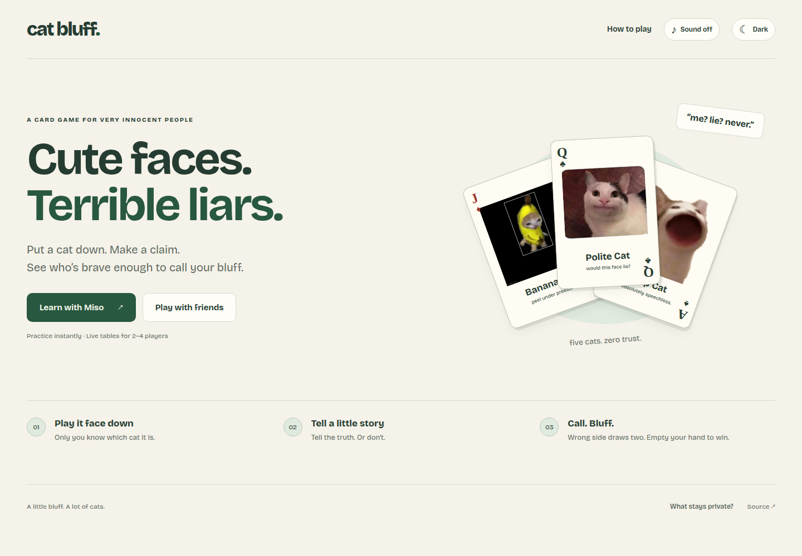

# Cat Bluff


> Cute faces. Terrible liars. A private cat-card bluffing game for 2–4 friends on Midnight.

**Release status:** [Cat Bluff is live on Vercel](https://cat-bluff-ashuu.vercel.app/) with its new Midnight Preprod contract. Schema 3, all seven circuit entrypoints, and their verifier keys were checked against this build through the public indexer. Local practice and compiled-circuit tests pass; a complete two-wallet game still needs live verification.



[Card table](screenshots/cat-bluff-table.png) · [Dark theme](screenshots/cat-bluff-dark.png) · [Mobile](screenshots/cat-bluff-mobile.png). These captures show local practice, not on-chain transactions.

## Live Demo

[Play Cat Bluff](https://cat-bluff-ashuu.vercel.app/). The [earlier site URL](https://midnight-secret-trail.vercel.app/) also serves Cat Bluff. Keep using the same browser and site address for an existing private hand.

Choose **Learn with Miso** for an instant guided game. Miso is a practice bot; results are checked locally, with no wallet, ZK proof or transaction.

For live play, create a table, copy **Invite friends**, and send the link to 1–3 players. Each connects Lace and joins before the host plays the first card. The link contains only the public table and contract IDs. Live tables poll confirmed ledger state every four seconds; invitations do not create fake players.

## Contract Address

| Version | Network | Address | Status |
| --- | --- | --- | --- |
| Cat Bluff V3 | Preprod | [`3cc6418a04b9d1e6deab06e5711e4e3c3876e697ba412202f932ebe030bc917e`](https://preprod.midnightexplorer.com/contracts/0x3cc6418a04b9d1e6deab06e5711e4e3c3876e697ba412202f932ebe030bc917e) | Schema 3 and all seven circuits verified |
| Secret Trail V2 | Preprod | [`61eafc2202ab691039994916cf4f5821dd97eee8df489872862aee472f79cc63`](https://preprod.midnightexplorer.com/contracts/0x61eafc2202ab691039994916cf4f5821dd97eee8df489872862aee472f79cc63) | Earlier route game; incompatible with Cat Bluff |

Cat Bluff uses **`VITE_CAT_BLUFF_CONTRACT_ADDRESS`** and ledger schema 3. Setting the old `VITE_CONTRACT_ADDRESS` does not enable this game. Never use the V2 address for Cat Bluff.

## What This Does

1. **Five cards each.** Everyone receives five private cards from Pop Cat, Huh Cat, Polite Cat, Banana Cat and Crying Cat. Repeated cats are allowed.
2. **Play one face down.** Select a real card in your hand, then announce any cat. The announcement may be true or a bluff.
3. **Pass or call bluff.** Other players respond in seat order. If everyone passes, the card is discarded without opening it.
4. **Settle a challenge.** The player who placed the card proves whether the announcement matches the committed card. A true claim makes the challenger draw two. A false claim makes the bluffer draw two.
5. **Empty your hand to win.** Your final card must be passed or settled first. A caught last-card bluff incurs its penalty instead of winning.

This variant uses a **draw-two penalty**, not picking up the entire shared pile. There is no money, token prize or financial stake. A room supports 2–4 players. The host starts it by playing the first card, after which no one else can join.

Live response and proof windows last 20 minutes to allow for prover, wallet and network delays. Once the response window expires, a participant can settle it as passed. Missing the proof window incurs a draw-two penalty and is recorded as a **timeout**, not a cryptographically established lie. An inactive player at the initial play stage can currently stall a table; create another room if necessary. Hands are capped at 64 cards; a penalty beyond that limit is rejected.

### Interface and performance

The welcome screen teaches three steps before showing the table. The guided practice deal uses one of each cat to teach the rules; subsequent unguided practice and live deals use browser randomness. Cards animate from your hand onto the table. Theme and optional meme sounds persist locally; sounds start off, and reduced-motion preferences are respected.

Actual cat meme images and short recorded Huh, Fahh and Pop sounds are served locally. [Media sources and credits](public/media-credits.json) identify their origins; third-party media is not covered by this repository's code licence.

The initial page and practice game do not load the Midnight proving runtime. Live play prefetches the next circuit's assets, caches them across moves, and warms the configured hosted prover before submission. Wallet configuration and shielded-address reads run concurrently. Starting the game is combined with the first play; pending penalty draws are absorbed into the next play rather than requiring a separate transaction. Challenge resolution and penalties also happen in one circuit call.

These changes remove avoidable requests and extra transactions. They **do not eliminate proof generation, Lace balancing or block confirmation time**. The UI shows the actual stage, elapsed time and final transaction receipt. A pending animation never counts as a confirmed move. No new live latency claim is made before the new contract has been measured on Preprod.

## Privacy Model

- **PUBLIC:** room IDs, pseudonymous player IDs, seat order, hand sizes, salted hand/card commitments, announced cats, turns, passes, challenges, deadlines, penalty counts, outcomes and winner.
- **PRIVATE:** the identity secret, hand composition, commitment salts, actual face-down card and its opening, and the composition of pending penalty draws. These are stored in the player's browser and supplied to the selected prover when required.
- **PROVED without revealing the remaining hand:** the player controls the registered identity; the played card belongs to the committed hand after permitted draws; the hand update consumes exactly one card; the challenged card opens the existing commitment; and the public true/false outcome matches the announcement.

## Privacy Claim

An on-chain observer sees a claim and its verdict. **A true claim identifies the played cat**, because the public announcement is now confirmed. A false claim rules out the announced cat without publishing which of the other four cats was played. Passing reveals no verdict. Other hand contents and salts are not published by the contract. Repeated observations and hand counts can still support deduction; this is not a claim that all strategy or identity metadata is hidden.

The private hand is saved in local storage, scoped by wallet, contract and room. Someone with access to that browser profile can read it. Clearing storage or changing browsers can prevent a player from finishing a game. An unconfirmed play retains its old and candidate hand openings so confirmation after a refresh can be recovered. The client refuses to overwrite an uncertain pending card with another play.

A **remote prover receives private proving inputs** and must be trusted. Use a local prover to avoid sending them off-device. The optional local bridge described below forwards data to a hosted service; it does not turn hosted proving into local proving.

**Fairness limitation:** the browser draws the cards, including penalties. The circuit enforces exact hand sizes and subsequent committed-card use, but does not prove unbiased random distribution. A modified client can choose its starting and drawn composition. This is a casual prototype, not a trustless shuffled deck or an audited game for prizes. A salted shared shuffle/deal protocol, recovery, anti-Sybil measures and adversarial testing are needed before competitive rewards.

## Tech Stack

| Layer | Technology |
| --- | --- |
| Interface | React 19, TypeScript, Vite 7, custom CSS |
| Contract | Compact 0.31.1, seven public circuits, schema 3 |
| Network | Midnight Preprod |
| Client | Midnight.js 4.1.1, Compact runtime 0.16 |
| Wallet | Lace connector API 4 |
| Tests | Node test runner via tsx, compiled circuit execution |
| CI / hosting | GitHub Actions / Vercel |

`contracts/cat-bluff.compact` is the new source; `managed/cat-bluff` contains its generated runtime, keys and ZKIR. Earlier contracts and their tests remain for regression/reference; they are not the live Cat Bluff contract.

## Prerequisites

- Node.js 22 and npm.
- Compact CLI 0.5.2 with compiler 0.31.1 for compilation; [official tooling guide](https://docs.midnight.network/compact/compilation-and-tooling).
- For live play: Lace on Preprod, usable tDUST, a working prover and the new Cat Bluff contract address.
- Practice needs only the app; it does not connect a wallet or prover.

## Setup & Run Locally

```bash
git clone https://github.com/ashuujha/midnight-secret-trail.git
cd midnight-secret-trail
npm ci
npm run compile
cat > .env.local <<'ENV'
VITE_MIDNIGHT_NETWORK=preprod
VITE_CAT_BLUFF_CONTRACT_ADDRESS=3cc6418a04b9d1e6deab06e5711e4e3c3876e697ba412202f932ebe030bc917e
# Optional hosted prover; omit to use the wallet's configured provider:
VITE_PROOF_SERVER_URL=https://midnight-counter-prover.onrender.com
ENV
npm run dev
```

Open the Vite URL and choose **Learn with Miso**. For deployment, leave the new address empty, choose **Play with friends → Set up live play**, connect Lace and click **Deploy Cat Bluff with Lace**. Approve the wallet request. Copy the returned address into `VITE_CAT_BLUFF_CONTRACT_ADDRESS` locally and in Vercel, then rebuild. Local development also saves the address to this browser so it can be used immediately.

To test two real players, use separate browser profiles and wallets. Create a table, send its invitation, join from the other profile, and have the host play a card. Exercise both pass and challenge outcomes and verify the public transaction receipts.

Alternatively, `npm run deploy:preprod` uses the deployment CLI and a separately funded wallet. Its ignored `.midnight-state.json` contains recovery data and must stay private. The browser flow uses your existing Lace wallet instead.

Some Lace versions expose only `http://localhost:6300` for their proof service. If using the project's hosted prover, run this in another terminal:

```bash
npm run proof:bridge
```

The bridge forwards Lace's `/check` and `/prove` requests to the hosted Render service. It must keep running while Lace balances transactions. The site's `VITE_PROOF_SERVER_URL` does **not** change Lace's setting. A free hosted service can sleep and impose a cold-start delay. For device-only proving, run a compatible Midnight proof server locally instead of this forwarding bridge.

## Run Tests

```bash
npm test
npm run build
npm run typecheck:deploy
# Compile + tests + production build + deployment typecheck:
npm run check
```

[Test output screenshot](screenshots/cat-bluff-tests.png) shows an excerpt and the full 46-test summary from `npm run check`.

The suite includes 12 new compiled-contract tests, seven card-table/invitation tests and three private-hand recovery tests, alongside the existing 24 regression tests. They exercise authorization, commitments, turn order, both challenge outcomes, penalty draws, timeouts, winner conditions, damaged state and uncertain transaction recovery. These are local execution tests, not evidence of an end-to-end on-chain proof or wallet transaction.

Browser checks cover the guided honest play, a bluff, bot responses, theme/sound controls, dialogs, media loading, keyboard/accessibility and mobile overflow. They are run separately; `npm run check` runs the commands listed above, not browser automation.

## CI/CD

[The workflow](.github/workflows/ci.yml) runs on pushes to `main` and pull requests. It installs Node 22 and the pinned Compact compiler, runs `npm ci`, compiles Cat Bluff, runs the tests, builds the production app and typechecks the deployment CLI. The badge above tracks `main`. [The Cat Bluff release PR passed CI](https://github.com/ashuujha/midnight-secret-trail/actions/runs/36214844178) before [PR #2 was merged](https://github.com/ashuujha/midnight-secret-trail/pull/2).

Vercel builds the static app with `npm run build`. Set the new contract environment variable before promoting Cat Bluff to production. A frontend deployment does not deploy a Midnight contract or prove that wallet play works.

## Product Proposal

See [PROPOSAL.md](PROPOSAL.md) for the product, Midnight rationale, data model and Mainnet scope. The new card mechanic evolves the previously approved secret-mission idea; approval of this changed proposal has not been represented as granted.

## Demo Video

Record a new Cat Bluff demo after deployment: connect two wallets; create/invite/join; play a face-down cat with a public claim; call bluff; settle with a proof; show the draw-two penalty and a transaction receipt. Include the test output and passing CI run. The earlier counter video is a different product.

## Submission Checklist

- ✓ Public repository and documentation.
- ✓ New Compact contract compiles; local tests pass.
- ✓ CI workflow and badge present.
- ✓ Cat Bluff Preprod address; schema and circuit entrypoints verified.
- ✗ Full two-wallet live playthrough.
- ✓ Cat Bluff production release and browser smoke checks.
- ✗ Current Cat Bluff game video.
- ✗ Dedicated product X profile linked in this README.
- ✓ Repository already contains at least 15 meaningful commits; no artificial commit padding.

## Media Credits

[Source manifest](public/media-credits.json). Cat images and meme recordings are third-party media with their original rights retained. Bricolage Grotesque is self-hosted with its [OFL licence](public/fonts/OFL.txt).
